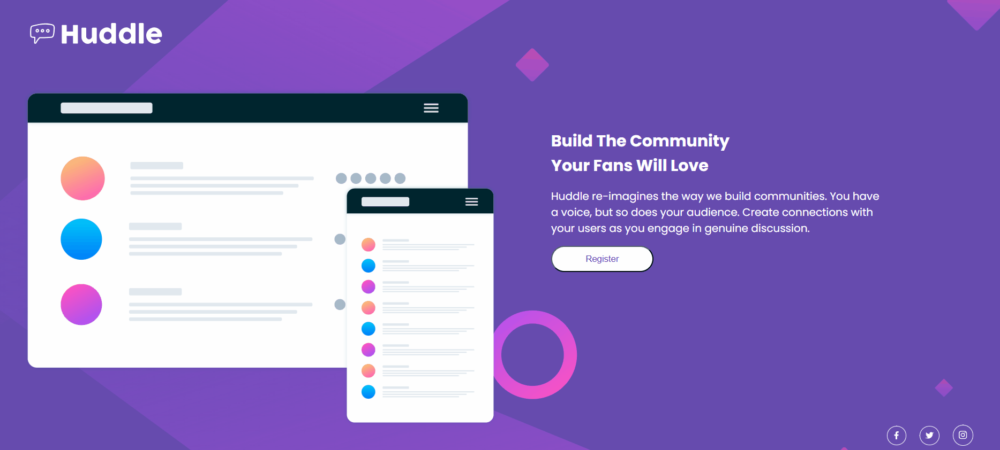

# PROJETO HUDDLE PAGE 🤩✨

<<<<<<< HEAD
[]
=======

>>>>>>> 5d0232011b55435d9858dfac78c46b9c565701ee

## Informações 

- Projeto de Huddle Page criado a partir do Front End Mentor

### Linguagens Utilizadas 

- HTML
- CSS

### Aprendizados
- Com este projeto, aprendi a adicionar e estilizar ícones do Font Awesome;
- Pratiquei o uso do display Flex;

<<<<<<< HEAD
[]
=======

>>>>>>> 5d0232011b55435d9858dfac78c46b9c565701ee

